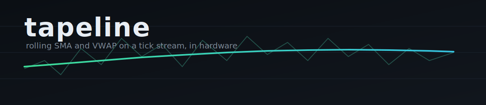

<p align="center">
  
</p>

<p align="center">
  <a href="https://github.com/tylrcc/tickmac/actions/workflows/ci.yml"></a>
  
  
  
  
  
</p>

# tickmac

A small FPGA IP core that computes rolling moving averages and VWAP over a live
tick stream, so the python strategy doesn't have to do it on every print.

The Python side of my trading stack is fine at deciding *what* to do, but
recomputing rolling windows on the hot path in software burns time I don't have
when the tape is fast. So I started pushing the boring, repetitive arithmetic
down into hardware. This is the first block: a multiply-accumulate engine that
keeps a simple moving average and a volume-weighted average over the last N
ticks and streams the answers back out. It is meant to live on a card next to a
host running the strategy, as an execution co-processor.

**One thing up front:** this is alpha, it is a hobby/research project, and it
computes numbers, it does not make trading decisions. Do not point it at a live
account and walk away.

## The idea in one paragraph

A naive moving average re-sums the whole window on every tick. That is `O(N)` per
tick and it scales badly when you want a long lookback at line rate. tickmac
keeps running accumulators instead and slides them one tick at a time: add the
new sample, drop the one rolling off the back. That is `O(1)` per tick no matter
how long the window is. The same trick gives you VWAP for free by carrying two
more sums. The whole design is built around that one decision, the rest is just
fixed point and not wrapping the accumulator.

## Try it without any hardware

You do not need an FPGA to run this. The whole thing simulates.

```bash
git clone https://github.com/tylrcc/tickmac
cd tickmac

# python golden-model tests, no fpga tools needed
make test

# full rtl simulation: regenerates vectors and runs the self-checking testbench
make sim
```

`make sim` needs [Icarus Verilog](http://iverilog.icarus.com/) (`iverilog`).
On macOS that is `brew install icarus-verilog`, on Debian/Ubuntu it is
`sudo apt-get install iverilog`. A green run ends in:

```
mac_engine_tb: 4000 ticks, 3937 checked, 0 errors
PASS
```

## How it is verified

This is the part I care most about, because silently-wrong fixed-point hardware
is the worst kind.

```
sim/reference.py   the golden model, plain integer python, the source of truth
        |
        v
sim/gen_vectors.py runs the model over a synthetic tape, writes expected outputs
        |
        v
tb/mac_engine_tb.v replays the same tape into the rtl, fails loudly on mismatch
```

So the laptop math and the silicon math are forced to agree, tick for tick, on
every push. If you change the algorithm you change it in both `reference.py` and
`mac_engine.v`, and the testbench keeps you honest.

## Fixed point

Price is Q16.16 (price times 2^16, unsigned). Volume is a plain unsigned
integer. The host packs ticks into that format with `host/fixed.py`, which is
the same helper the strategy repo imports, so there is exactly one place that
knows where the binary point sits.

- SMA is a shift, because the window size is forced to a power of two.
- VWAP is a real divide (the denominator is data-dependent). That divider is
  the most expensive thing in the design and is first in line to get replaced.

## Layout

```
tickmac/
├── rtl/
│   ├── mac_engine.v        rolling SMA + VWAP, the actual core
│   └── tick_sync_fifo.v    host-boundary fifo, gives real backpressure
├── tb/
│   └── mac_engine_tb.v     self-checking testbench, replays the golden tape
├── sim/
│   ├── reference.py        golden model (source of truth)
│   ├── gen_vectors.py      writes the test vectors from the model
│   └── test_reference.py   fast python tests for the math
├── host/
│   └── fixed.py            Q16.16 + tick packing, imported by the strategy repo
├── docs/
│   ├── interface.md        stream contract + register map
│   └── architecture.md     datapath, fixed point, timing
└── Makefile                make test / make sim / make lint
```

## Where it is rough

I would rather list the holes than pretend they are not there:

- **The divider is slow.** VWAP uses a synth-time divide right now. It works, it
  eats LUTs and gates timing. A pipelined Newton-Raphson reciprocal is the plan.
- **The fifo is single-clock.** The real PCIe side crosses a clock domain and
  needs a proper async fifo with gray pointers before it touches an XDMA core.
- **No host driver yet.** The AXI4-Lite register block and the DMA glue are
  described in `docs/interface.md` but not written. So today it passes sim, it
  does not yet run on a board end to end.
- **Synthetic data only.** I test against a random walk, not a real tape. It has
  not met a true ES/NQ open gap, which is exactly where the accumulator sizing
  gets stressed.

## Roadmap

- [ ] register the multiplier, pipeline the accumulator update for fmax
- [ ] Newton-Raphson reciprocal to replace the divide
- [ ] async fifo for the PCIe clock crossing
- [ ] AXI4-Lite register block + a minimal host driver
- [ ] EMA core (the multiply-add cousin of this one)
- [ ] real recorded tick tapes in the vector set

## Contributing

It is just me on this so far. If you know RTL, fixed-point DSP, or FPGA host
integration, I would love the help, and honestly the most useful thing right now
is breaking the testbench with a realistic tape. See
[CONTRIBUTING.md](CONTRIBUTING.md).

## License

Dual-licensed, which is normal for open hardware: the RTL and docs are
CERN-OHL-P, the model and tooling are MIT. See [LICENSE](LICENSE) and
[LICENSE-MIT](LICENSE-MIT).

This is not financial advice and it comes with no warranty. It is a calculator,
the trading decisions are still on you.
